

<h1 align="center">Lovely Stream Deck Icons</h1>

A collection of icons for use with your Elgato Stream Deck.

 

### 🔌 If you like this project, please consider subscribing to my Youtube channel [Lovely Sim Racing](http://j76.me/LSR), where I stream as often as I can. You'll even see these icons on my Stream Deck.

 

# Usage

[**Download the latest release**](https://github.com/cdemetriadis/lovely-streamdeck-icons/releases), unzip the file and use the icons on your stream deck. These icons are focused more on the Sim Racing community needs, but feel free to use them if you find them useful.

The icons are subject to the [CC-BY-NC-SA license](#disclaimer).

# Icon Preview

## Generic

## Streaming

### Scenes

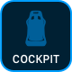

### Sources

## Lights

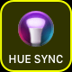
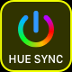
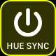

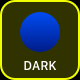

## Music

## Messages

## Vehicle

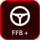

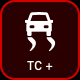
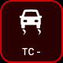
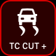
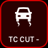

## Applications

### Simulators
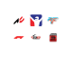

### Other

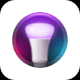

## Settings

### PC

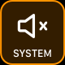

### OBS

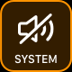

### Discord

### Audio
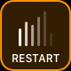

  

---

  

### Disclaimer

All trademarks, logos and brand names are the property of their respective owners. All company, product and service names used in this application are for identification purposes only. Use of these names, trademarks and brands does not imply endorsement.

 

This work is licensed under [Creative Commons Attribution-NonCommercial-ShareAlike 4.0 International](http://creativecommons.org/licenses/by-nc-sa/4.0/)
