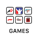
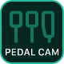

<h1 align="center">Lovely Stream Deck Icons</h1>

A collection of Lovely Icons specifically designed for Sim Racing enthusiasts, for use on your <a href="https://www.elgato.com/en/stream-deck" target="_blank">Elgato Stream Deck</a>.

 

<h3 align="center"><a href="https://github.com/cdemetriadis/lovely-streamdeck-icons/releases">305 NEW & UPDATED ICONS in v1.6.1</a></h3>

 

### 🔌 If you like this project, please consider subscribing to my Youtube channel [Lovely Sim Racing](https://lsr.gg/youtube), where I stream as often as I can. You'll even see these icons on my Stream Deck.

### Please consider to [Buy me a Coffee](https://lsr.gg/support) :coffee: or snag some [Lovely Merch](https://lsr.gg/store)

#### Check out my other projects:
* [**Lovely Dashboard**](https://lsr.gg/dash)

---

 

## Download

### Elgato Stream Deck Store
In your **Stream Deck App**, visit the **Store** and search for `Lovely Sim Racing Icons`. You can install the **Icon Pack** directly within the app, and also receive future updates.

### Standalone Icons
Alternatively, you can find and download the high resolution icons (.png & .svg) in the :open_file_folder: [**Latest Releases**](https://github.com/cdemetriadis/lovely-streamdeck-icons/releases). Unzip the file and use the icons on your Stream Deck directly.

## Icon Preview

### Generic

  
  
  
  

### Apps

  
  
  
  
  
  
  
  
  
  
  
  
  
  
  
  
  
  
  
  
  
  
  
  
  
  
  
  
  
  
  
  
  
  
  
  
  
  
  
  
  
  
  
  
  
  

### Scenes

  
  
  
  
  
  
  
  
  
  
  
  
  
  
  
  
  
  
  
  
  
  
  
  
  
  
  
  
  
  

### Sources

  
  
  
  
  
  
  
  
  
  
  
  
  
  
  
  
  
  
  
  

### Messages

  
  
  
  
  
  
  
  
  
  
  
  
  
  
  
  

### Vehicle

  
  
  
  
  
  
  
  
  
  
  
  
  
  
  
  
  
  
  
  
  
  
  
  
  
  
  
  
  
  
  
  
  
  
  
  
  
  
  
  
  
  
  
  
  
  
  
  
  
  
  
  
  
  
  
  
  
  
  
  
  
  
  
  
  
  
  

### Music

  
  
  
  
  
  
  
  
  
  
  
  
  
  

### Settings

  
  
  
  
  
  
  
  
  
  
  
  
  
  
  
  
  
  
  
  
  
  
  
  
  
  
  
  
  
  
  
  
  
  
  
  
  
  
  
  
  
  
  
  
  
  
  
  
  
  
  
  
  
  
  
  
  
  
  
  
  
  
  
  
  
  
  
  
  
  
  
  

### Lights

  
  
  
  
  
  
  
  
  
  
  
  
  
  
  
  
  
  
  
  
  
  
  
  
  
  
  
  
  
  
  
  

  

---

All trademarks, logos and brand names are the property of their respective owners. All company, product and service names used in this application are for identification purposes only. Use of these names, trademarks and brands does not imply endorsement.

This work is licensed under [Creative Commons Attribution-NonCommercial-ShareAlike 4.0 International](http://creativecommons.org/licenses/by-nc-sa/4.0/)
